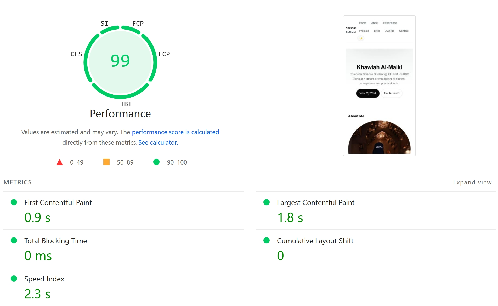

# 🌐 Portfolio Website – Assignment 3

## 📖 Project Description

This personal portfolio website was developed as part of **Assignments 1–3** in the Web Engineering course. It demonstrates progressive enhancement — from basic structure to advanced interactivity and client-side data persistence — using **HTML, CSS, and vanilla JavaScript**.

The site showcases my background, projects, experience, and achievements in a **modern, responsive, and interactive design**, following accessibility standards and clean-code practices.

---

## ✨ Features

### 🧱 Core Structure

* **About Me** – Intro section with profile image and personal summary
* **Projects** – Grid layout with project cards and descriptions
* **Experience Timeline** – Vertical timeline with styled cards
* **Skills & Awards** – Categorized lists and highlights
* **Contact Form** – Validation + error messages
* **Dark Mode** – System-aware theme with toggle
* **Responsive Design** – Mobile-first using Flexbox & Grid

---

### ⚙️ Interactive Enhancements

* **Dynamic Projects Section**
  ✓ Search
  ✓ Filter
  ✓ Sort (A–Z, Z–A, date)

* **Experience Collapse & Persistence**
  ✓ Expand/collapse
  ✓ Keyboard accessible
  ✓ Saves state with `localStorage`

* **Contact Form Enhancements**
  ✓ Field validation (custom rules)
  ✓ Saves name + email to `localStorage`

* **Scroll Animations**
  ✓ Reveal effects via `IntersectionObserver`

* **Weather Widget**
  ✓ Live temperature
  ✓ Emoji mapped to weather condition
  ✓ Timer in `mm:ss` format

* **Theme Persistence**
  ✓ Saves user’s dark/light mode
  ✓ Loads preference on every visit

---

## ⚡ Performance Optimization

* Compressed and resized large images (e.g., profile photo)
* Lazy-loaded non-critical images
* Added width/height attributes to avoid layout shift
* Inlined a small critical CSS block for faster initial paint
* Preloaded CSS to reduce render-blocking
* Removed unused code and minimized rendering delays

### 📊 Final Lighthouse Performance Score



**Final Score: 99 (Mobile)**

* First Contentful Paint: **0.9 s**
* Largest Contentful Paint: **1.8 s**
* Total Blocking Time: **0 ms**
* Cumulative Layout Shift: **0**

---

## 🛠️ Setup Instructions

1. Open your terminal
2. Navigate to your preferred folder:

   ```bash
   cd Documents
   ```
3. Clone the repository:

   ```bash
   git clone https://github.com/KhawlaAlmalki/assignment-3
   ```
4. Enter the project:

   ```bash
   cd assignment-3
   ```
5. Open `index.html` or use Live Server

No installation required — static website.

---

## 🤖 AI Usage

AI support (ChatGPT – GPT-5) was used for:

* Debugging JavaScript
* Optimizing UI layout and responsiveness
* Improving accessibility and animations
* Generating documentation structure
* Reviewing and explaining APIs (localStorage, IntersectionObserver, timers)

All AI-assisted content was **reviewed, rewritten, and verified** manually.
More details in:
👉 `docs/ai-usage-report.md`

---

## 🚀 Live Demo

🔗 [https://khawlaalmalki.github.io/assignment-3/](https://khawlaalmalki.github.io/assignment-3/)
